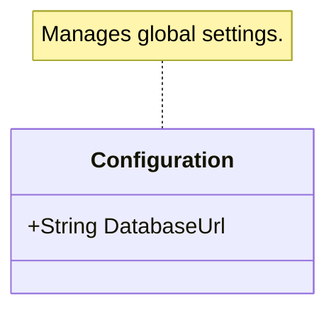
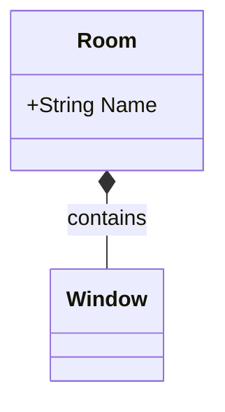

# Mermaid to C# Code Generator 🧜‍♂️💻

Transform your UML class diagrams drawn with **Mermaid.js** (inside Markdown files) into ready-to-use **C# source code** with a single click!

This extension is the ideal companion for software architecture (Class Design), allowing you to quickly move from visual design to code implementation while maintaining C# language conventions and standards.

## ✨ Main Features

* 🏗️ **Full OOP Support**: Generates Classes, Interfaces (`<<interface>>`), Abstract Classes (`<<abstract>>`), and Enumerations (`<<enumeration>>`).

* 🧬 **Inheritance and Implementation**: Recognizes UML arrows (`<|--` and `<|..`) and maps them correctly in C#.

* 🔗 **Smart Relationships**: Associations, aggregations (`o--`), and compositions (`*--`) automatically generate navigation properties in the code.

* 📝 **XML Docstrings (///)**: Generates `<summary>` comments extracting them from HTML comments (`<!-- ... -->`) or Mermaid's `note for` directives.

* ⚙️ **Fields vs Properties**: Automatically applies C# conventions. Names in `camelCase` become `private` Fields, names in `PascalCase` become `public` Auto-Properties.

* 📦 **Generics Support**: Natively translates Mermaid generics syntax (e.g., `List~string~`) into C# (`List<string>`).

* 🔐 **Access Modifiers and Special Members**: Supports `public` (+), `private` (-), `protected` (#), `internal` (~), as well as `static` ($) and `abstract` (*) members.

## 🚀 How to Use

1. Open any **Markdown (`.md`)** file in VS Code containing a ````mermaid```` block with a `classDiagram`.

2. Open the VS Code Command Palette (`Ctrl+Shift+P` on Windows/Linux, `Cmd+Shift+P` on Mac).

3. Search for and execute the command: **`Mermaid-Code: Generate Classes from Mermaid Diagram`**.

4. The `.cs` files will be generated instantly in the same folder as your Markdown file!

## 📖 Usage Examples

### 1. Base Class with Properties, Fields, and Methods

The extension automatically distinguishes between *Fields* (camelCase) and *Auto-Properties* (PascalCase), applying the correct C# types.

**Mermaid (Markdown):**

````markdown
```mermaid
classDiagram
    class User {
        -string _password
        +String Username
        +List~Role~ Roles
        +Login(string username, string password) bool
    }
    **Generated C# Code (`User.cs`):**

```
````

```cs
/**
 * Auto-generated from Mermaid UML diagram
 */
using System;
using System.Collections.Generic;

namespace MermaidGenerated
{
    public class User
    {
        private string _password;
        public string Username { get; set; }
        public List<Role> Roles { get; set; }

        public bool Login(string username, string password)
        {
            // TODO: Implementation
            throw new NotImplementedException();
        }
    }
}
```

### 2. Inheritance, Interfaces, and Abstract Classes

Advanced management of hierarchies and enforcement of abstract methods.

**Mermaid (Markdown):**

````markdown
```mermaid
classDiagram
    <<interface>> IAnimal
    <<abstract>> Mammal
    
    IAnimal <|.. Mammal
    Mammal <|-- Dog
    
    class IAnimal {
        +Eat() void
    }
    
    class Mammal {
        +int Age
        +Walk()*
    }
    
    class Dog {
        +Bark()
    }
```
````

## Generated C# Code (Mammal.cs and others):
```cs
public abstract class Mammal : IAnimal
    {
        public int Age { get; set; }

        public abstract void Walk();
    }
```

### 3. Docstring Generation from Notes and Comments

You can document your code directly from the diagram!

**Mermaid (Markdown):**

## Generated C# Code (Configuration.cs):
```cs
    /// <summary>
    /// Manages global settings.
    /// </summary>
    public class Configuration
    {
        /// <summary>
        /// The main database URL
        /// </summary>
        public string DatabaseUrl { get; set; }
    }
```

### 4. Composition and Aggregation (Navigation Properties)

If you define a visual relationship between two classes (e.g., a Room contains Windows), the extension will create the property automatically!

**Mermaid (Markdown):**


## Generated C# Code (Room.cs):

```cs
    public class Room
    {
        public string Name { get; set; }
        public Window Window { get; set; } // <-- Automatically generated from the *-- relationship
    }
```

## ⚠️ Requirements and Limitations
The file where the command is executed must be saved on disk and have a .md extension.

Ensure that the code blocks correctly start with mermaid and contain the keyword classDiagram.

## 🤝 Contributing
Bug reports and pull requests are welcome! If your UML diagram is not generated as expected, open an Issue attaching the problematic Mermaid block.